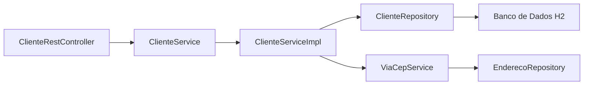
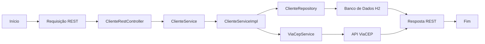

# Explorando Padrões de Projetos na Prática com Java

Este projeto demonstra a implementação de padrões de projeto utilizando o **Spring Framework**. Ele foi desenvolvido como parte do Lab "Explorando Padrões de Projetos na Prática com Java" e utiliza uma API REST para gerenciar clientes e endereços, integrando-se com a API pública do **ViaCEP** para buscar informações de endereço.

---

## 📋 Funcionalidades

- **CRUD de Clientes**: Permite criar, ler, atualizar e deletar clientes.
- **Integração com ViaCEP**: Busca informações de endereço a partir do CEP informado.
- **Banco de Dados H2**: Persistência de dados utilizando o banco de dados em memória H2.
- **Documentação OpenAPI/Swagger**: Interface para explorar e testar a API.

---

## 🛠️ Tecnologias Utilizadas

- **Java 11**
- **Spring Boot 2.5.4**
- **Spring Data JPA**
- **Spring Web**
- **Spring Cloud OpenFeign**
- **H2 Database**
- **OpenAPI/Swagger**

---

## 🏗️ Arquitetura do Projeto

O projeto segue uma arquitetura baseada em camadas, com a aplicação de padrões de projeto como **Singleton**, **Strategy**, **Repository** e **Facade**.

### Diagrama de Arquitetura

### 🔄 Fluxo de Execução

### 📂 Estrutura do Projeto

    src/
    ├── main/
    │   ├── java/
    │   │   └── one.digitalinnovation.gof/
    │   │       ├──           # Classe principal
    │   │       ├── controller/
    │   │       │   └──   # Controlador REST
    │   │       ├── model/
    │   │       │   ├──           # Entidade Cliente
    │   │       │   ├──          # Entidade Endereço
    │   │       │   ├──  # Repositório Cliente
    │   │       │   └──  # Repositório Endereço
    │   │       ├── service/
    │   │       │   ├──    # Interface de serviço
    │   │       │   ├──     # Cliente HTTP para ViaCEP
    │   │       │   └── impl/
    │   │       │       └──  # Implementação do serviço
    │   └── resources/
    │       └── application.properties        # Configurações do Spring Boot
    └── test/
        └── java/
            └── one.digitalinnovation.gof/
                └──  # Testes

### 🚀 Como Executar
Clone o repositório:

Execute o projeto:

    ./mvnw spring-boot:run

Acesse a API:

    Documentação Swagger: http://localhost:8080/swagger-ui.html
    Banco de Dados H2: http://localhost:8080/h2-console

### 🧩 Padrões de Projeto Aplicados
1. Singleton:  O Spring gerencia as instâncias de serviços como singletons.
2. Strategy: A interface ClienteService permite múltiplas implementações.
3. Repository: Utilização do Spring Data JPA para abstrair operações de banco de dados.
4. Facade: O ClienteRestController simplifica a interação com os serviços e repositórios.

### ✍️ Autor
Projeto desenvolvido por Guilherme Marlon como parte do Lab "Explorando Padrões de Projetos na Prática com Java".